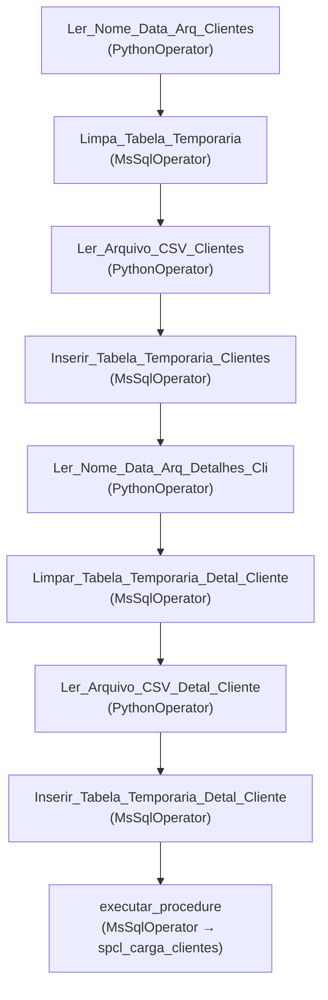

# A Jornada dos Dados: A Carga dos Clientes

[← Voltar a Engenharia de Dados](https://github.com/joycequoos/Data_Enginer/blob/main/README.md)

Pipeline de ETL construído com Apache Airflow para a carga diária de dados de clientes: leitura de arquivos `.csv`, carga em tabelas temporárias no SQL Server e tratamento final via Stored Procedure.

  

## Índice

- [Cenário](#cenário)
- [Fluxo da DAG](#fluxo-da-dag)
- [Etapas da DAG](#etapas-da-dag)
- [Arquivos do repositório](#arquivos-do-repositório)
- [Próximos passos](#próximos-passos)

---

## Cenário

💡 Imagine fazer parte de uma força-tarefa de inteligência financeira, responsável por proteger o sistema contra atividades suspeitas de lavagem de dinheiro. Todos os dias, um grande volume de dados de clientes é gerado e precisa ser processado, transformado e analisado com cuidado para garantir a segurança do sistema financeiro.

Para isso, esta pipeline realiza a **Carga de Clientes**: captura as informações na origem e as transporta até uma base de destino, onde a análise de dados poderá ser aplicada posteriormente. Neste cenário específico, a DAG lê arquivos `.csv` disponibilizados diariamente em um diretório do servidor, transporta e trata os dados no SQL Server.

## Fluxo da DAG

A DAG `LOAD_CLIENTE` roda todos os dias às 15h e processa dois arquivos em sequência — **Clientes** e **Detalhes de Clientes** — antes de acionar a procedure final de tratamento:

| Item | Valor |
| --- | --- |
| **Nome da DAG** | `LOAD_CLIENTE` |
| **Agendamento** | `0 15 * * *` — todos os dias às 15h |
| **Catchup** | Desativado (`catchup=False`), evitando execuções retroativas |
| **Tags** | `Cambio`, `Clientes`, `Sircoi` |
| **Conexão** | `sqlserver` (via `MsSqlHook` / `MsSqlOperator`) |

## Etapas da DAG

### Bloco 1 — Clientes

| # | Task | O que faz |
| --- | --- | --- |
| 1 | `Ler_Nome_Data_Arq_Clientes` | Consulta a tabela `dbo.tsv_server_status` para montar dinamicamente o nome do arquivo de clientes a ser lido naquele dia (nome base + data de referência), e devolve o resultado via XCom |
| 2 | `Limpa_Tabela_Temporaria` | Executa `TRUNCATE TABLE ttp_cliente`, limpando a tabela temporária antes de receber a nova carga |
| 3 | `Ler_Arquivo_CSV_Clientes` | Recupera o nome do arquivo (via `xcom_pull`), lê o `.csv` com `pandas` (sem cabeçalho, separador `;`, codificação `latin1`) e monta dinamicamente as instruções `INSERT` para cada linha do arquivo |
| 4 | `Inserir_Tabela_Temporaria_Clientes` | Executa no SQL Server os `INSERT`s gerados na task anterior, inserindo os dados na tabela temporária `ttp_cliente` |

### Bloco 2 — Detalhes de Clientes

| # | Task | O que faz |
| --- | --- | --- |
| 5 | `Ler_Nome_Data_Arq_Detalhes_Cli` | Mesma lógica da task 1, mas para o arquivo de **detalhes** dos clientes (endereço, renda, patrimônio, etc.) |
| 6 | `Limpar_Tabela_Temporaria_Detal_Cliente` | `TRUNCATE TABLE ttp_cliente_detalhe_generico`, limpando a tabela temporária de detalhes |
| 7 | `Ler_Arquivo_CSV_Detal_Cliente` | Lê o `.csv` de detalhes (18 colunas: endereço, cidade, renda, patrimônio, data de nascimento, etc.) e monta os `INSERT`s correspondentes |
| 8 | `Inserir_Tabela_Temporaria_Detal_Cliente` | Insere os dados de detalhes na tabela temporária `ttp_cliente_detalhe_generico` |

### Bloco 3 — Tratamento final

| # | Task | O que faz |
| --- | --- | --- |
| 9 | `executar_procedure` | Busca a data de referência em `tsv_server_status` e executa a procedure `dbo.spcl_carga_clientes`, que trata (formatação de datas, remoção de duplicidades, entre outros) e insere/atualiza os dados nas tabelas **definitivas** de Clientes e Detalhes de Clientes |

> As duas tasks de leitura de CSV (`read_csv_file` e `read_csv_file_2`) montam os `INSERT`s concatenando os valores diretamente na string SQL — funciona para o volume do exemplo, mas vale considerar os cuidados listados em "Próximos passos" abaixo antes de levar isso para produção.

## Arquivos do repositório

| Arquivo | Descrição |
| --- | --- |
| [`ETL_CLIENTES.py`](https://github.com/joycequoos/Pipeline_Airflow/blob/main/Anexos/ETL_CLIENTES.py) | Código completo da DAG `LOAD_CLIENTE`, com as 9 tasks descritas acima |
| [`cliente_20231019.csv`](https://github.com/joycequoos/Pipeline_Airflow/blob/main/Anexos) | Arquivo de exemplo com os dados de clientes |
| [`detalhe_cliente_20231019.csv`](https://github.com/joycequoos/Pipeline_Airflow/blob/main/Anexos) | Arquivo de exemplo com os detalhes dos clientes |
| [`spcl_carga_clientes.sql`](https://github.com/joycequoos/Pipeline_Airflow/blob/main/Anexos/spcl_carga_clientes.sql) | Procedure responsável pelo tratamento e pela carga final nas tabelas definitivas |

## Próximos passos

- Substituir a montagem manual de `INSERT` por parâmetros (`?` / `%s`) em vez de concatenação de string, para eliminar o risco de SQL Injection e problemas com aspas simples em nomes/endereços (hoje tratado com `.replace("'", ",")`, que altera o dado original).
- Trocar o laço `for _, row in df.iterrows(): ...` por uma carga em lote (ex.: `executemany` ou Bulk Insert), já que inserir linha a linha via string concatenada não escala bem para arquivos grandes.
- Adicionar tratamento de erro (`try/except` nas tasks Python, e `on_failure_callback` na DAG) para lidar com arquivo ausente ou colunas divergentes.
- Parametrizar o caminho `dags/data/{file_name}.csv` e revisar se ele reflete a estrutura real de pastas do ambiente de produção.
